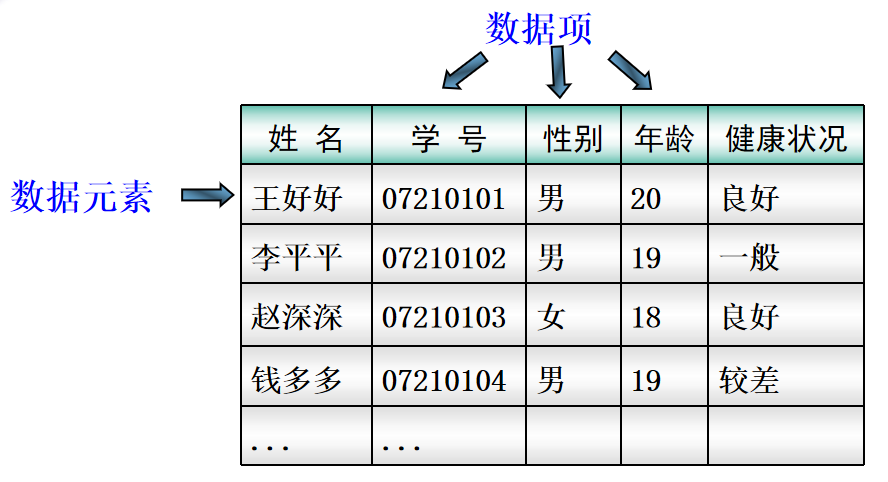

# 绪论

<!--author：yg		time:2019/07/12 13:04		title:绪论-->

## 1、基本概念

| 名词     | 概念                                                         |
| -------- | ------------------------------------------------------------ |
| 数据     | 所有能输入到计算机中并能被计算机程序识别和处理的符号集合。   |
| 数据元素 | 数据的基本单位，在计算机程序中通常作为一个整体进行考虑和处理。 |
| 数据项   | 构成数据元素的不可分割的最小单位。                           |



**<u>包含关系：数据是由数据元素组成，数据元素是由数据项组成。</u>**

------

| 名词     | 概念                                                         |
| -------- | ------------------------------------------------------------ |
| 数据结构 | 相互之间存在一定关系的数据元素的集合。按照视点的不同，数据结构分为逻辑结构和存储结构。 |
| 逻辑结构 | 从具体问题抽象出来的数据模型。                               |
| 存储结构 | 又称为物理结构，是数据及其逻辑结构在计算机中的表示。         |

### 典型的逻辑结构 ：

1. 集合	数据元素之间就是 “属于同一个集合”
2. 线性表    数据元素之间存在着一对一的线性关系
3. 树    数据元素之间存在着一对多的层次关系
4. 图      数据元素之间存在着多对多的任意关系

### 典型的存储结构 ：

1. 顺序存储	顺序表ArrayList
2. 链式存储    单链表LinkedList 
3. 散列存储    键值对HashMap（key:value）
4. 索引存储    数据库索引（Index）


**一种数据的逻辑结构可以用多种存储结构来存储，而采用不同的存储结构，其数据处理的效率往往是不同的。**

举例说明：

线性表可以用顺序存储也可以用链式存储；线性表的插入、删除操作，在顺序存储下时间复杂度为O(n)；在链式存储下时间复杂度为O(1)。


## 2、算法

### 定义

算法（Algorithm）：是对特定问题求解步骤的一种描述，是指令的有限序列。其中每一条指令表示一个或多个操作。

### 特性

有穷性、确定性、可行性、输入和输出

### 描述方法

| 方法名       | 优点           | 缺点                   |
| ------------ | -------------- | ---------------------- |
| 自然语言描述 | 容易理解       | 冗长、二义性           |
| 程序设计语言 | 能由计算机执行 | 抽象性差，对语言要求高 |
| 流程图       | 流程直观       | 缺少严密性、灵活性     |


## 3、复杂度

- 时间维度：是指执行当前算法所消耗的时间，我们通常用「时间复杂度」来描述。
- 空间维度：是指执行当前算法需要占用多少内存空间，我们通常用「空间复杂度」来描述。

### 时间复杂度

怎么求？

Ⅰ)把这个算法程序运行一遍，那么它所消耗的时间就自然而然知道了。（不推荐，因为在性能高的机器上跑出来的结果与在性能低的机器上跑的结果相差会很大。而且对测试时使用的数据规模也有很大关系。）

Ⅱ)「 **大O符号表示法** 」，即 T(n) = O(f(n))

我们先来看个例子：

```C++
for(i=1; i<=n; i++){
    cout<<"Hello World";
}
```

通过「 大O符号表示法 」，这段代码的时间复杂度为：O(n) ，为什么呢?

在 大O符号表示法中，时间复杂度的公式是： T(n) = O( f(n) )，其中f(n) 表示每行代码执行次数之和，而 O 表示正比例关系，这个公式的全称是：**算法的渐进时间复杂度**。

n = 1时：程序执行1次，f(n) = 1

n = 2时：程序执行2次，f(n) = 2

。。。

n = n时：程序执行n次，f(n) = n

**常见的时间复杂度量级有：**

- 常数阶O(1)
- 对数阶O(logN)
- 线性阶O(n)
- 线性对数阶O(nlogN)
- 平方阶O(n²)
- 立方阶O(n³)
- K次方阶O(n^k)
- 指数阶(2^n)


1、常数阶O(1)

无论代码执行了多少行，只要是没有循环等复杂结构，那这个代码的时间复杂度就都是O(1)，如：

```C++
int i = 1;
int j = 2;
++i;
j++;
int m = i + j;
```

上述代码在执行的时候，它消耗的时候并不随着某个变量的增长而增长，那么无论这类代码有多长，即使有几万几十万行，都可以用O(1)来表示它的时间复杂度。

2、线性阶O(n)

这个在最开始的代码示例中就讲解过了，如：

```C++
for(i=1; i<=n; ++i)
{
   cout<<"xxx";
}
```

这段代码，for循环里面的代码会执行n遍，因此它消耗的时间是随着n的变化而变化的，因此这类代码都可以用O(n)来表示它的时间复杂度。

3、对数阶O(logN)

还是先来看代码：

```C++
int i = 1;
while(i<n)
{
    i = i * 2;
}
```

从上面代码可以看到，在while循环里面，每次都将 i 乘以 2，乘完之后，i 距离 n 就越来越近了。

我们试着求解一下，假设n=2，循环x次之后，i 就大于 2 了，此时这个循环就退出了，也就是说
$$
2^x = n
$$
$$
x = log_2 n
$$

也就是说当循环 log2^n 次以后，这个代码就结束了。因此这个代码的时间复杂度为：O(logn)

4、线性对数阶O(nlogN)

线性对数阶O(nlogN) 其实非常容易理解，将时间复杂度为O(logn)的代码循环N遍的话，那么它的时间复杂度就是 n * O(logN)，也就是了O(nlogN)。

就拿上面的代码加一点修改来举例：

```C++
for(m=1; m<n; m++)
{
    i = 1;
    while(i<n)
    {
        i = i * 2;
    }
}
```

5、平方阶O(n²)

平方阶O(n²) 就更容易理解了，如果把 O(n) 的代码再嵌套循环一遍，它的时间复杂度就是 O(n²) 了。
举例：

```C++
for(x=1; i<=n; x++)
{
   for(i=1; i<=n; i++)
    {
       cout<<"xxx";
    }
}
```

这段代码其实就是嵌套了2层n循环，它的时间复杂度就是 O(n*n)，即  O(n²) 
如果将其中一层循环的n改成m，即：

```C++
for(x=1; i<=m; x++)
{
   for(i=1; i<=n; i++)
    {
       cout<<"xxx";
    }
}
```


那它的时间复杂度就变成了 O(m*n)

立方阶O(n³)、K次方阶O(n^k)

参考上面的O(n²) 去理解就好了，O(n³)相当于三层n循环，其它的类似。


### 最好情况、最坏情况、平均情况

冒泡排序

***最好情况***：

正序如1，2，3，4，5

比较次数：4次(n-1)

移动次数：0次

时间复杂度：O(n)

***最坏情况***：

倒序如5，4，3，2，1

比较次数：
$$
\sum_{i=1}^{n-1}(n-i) = \frac{n(n-1)}{2}
$$

移动次数：
$$
\sum_{i=1}^{n-1}3(n-i) = \frac{3n(n-1)}{2}
$$

时间复杂度：O(n²)

***平均情况***：O(n²)


### 空间复杂度

空间复杂度是对一个算法在运行过程中临时占用存储空间大小的一个量度，同样反映的是一个趋势，我们用 S(n) 来定义。

空间复杂度比较常用的有：O(1)、O(n)、O(n²)：

1、空间复杂度 O(1)

如果算法执行所需要的临时空间不随着某个变量n的大小而变化，即此算法空间复杂度为一个常量，可表示为 O(1)
举例：

```C++
int i = 1;
int j = 2;
++i;
j++;
int m = i + j;
```


代码中的 i、j、m 所分配的空间都不随着处理数据量变化，因此它的空间复杂度 S(n) = O(1)

2、空间复杂度 O(n)

我们先看一个代码：

```C++
int[] m = new int[n]
for(i=1; i<=n; ++i)
{
   j = i;
   j++;
}
```

这段代码中，第一行new了一个数组出来，这个数据占用的大小为n，这段代码的2-6行，虽然有循环，但没有再分配新的空间，因此，这段代码的空间复杂度主要看第一行即可，即 S(n) = O(n)

